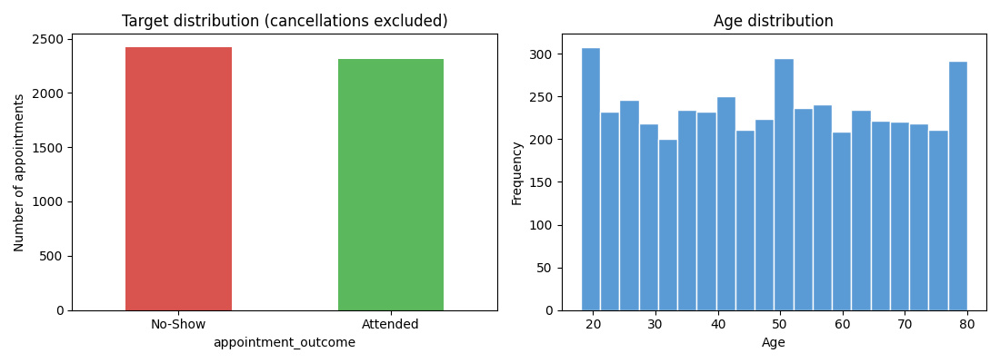
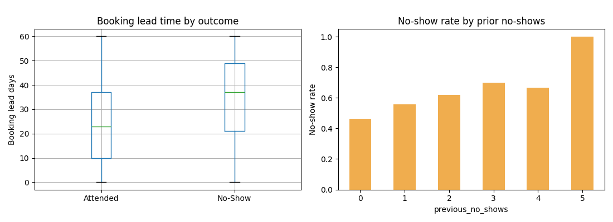
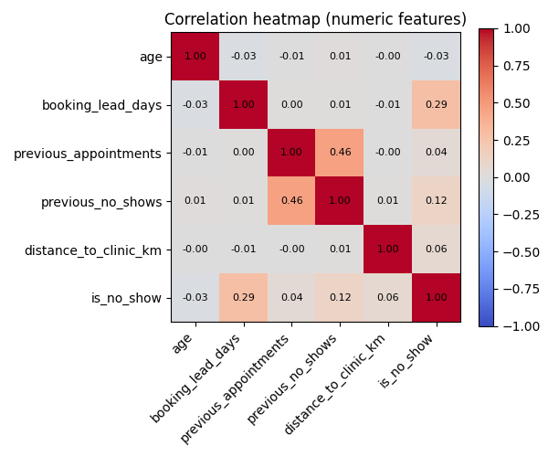
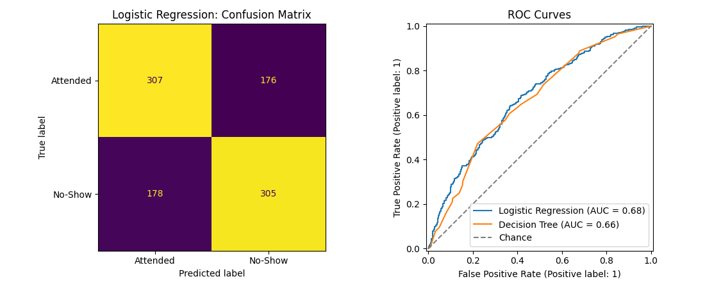

# HealthConnect-Project-Solution-Development-Implementation

**AnalystLab Africa Experience Lab | Data Science Track**

Predicting appointment no-shows for a fictional healthcare provider, HealthConnect Clinic, so the clinic can intervene before a slot is lost.

> **Central project question:** How can HealthConnect Clinic use data and AI to reduce missed appointments and improve the patient support experience?

This repository covers the Data Science track's contribution to the shared, multi-track HealthConnect Experience Lab. Other tracks (Project Management, Data Analytics, Machine Learning Engineering, Generative AI) are contributing their own deliverables against the same business problem and dataset.

---

## Project Status

| Week | Focus | Status |
|---|---|---|
| Week 4 | Problem definition & initial data assessment | ✅ Complete |
| Week 5 | Data preparation, feature engineering & baseline model | ✅ Complete |
| Week 6 | Cross-validation, tuned ensemble model, threshold analysis | 🔜 Planned |

---

## Problem Definition

HealthConnect Clinic loses appointment slots whenever a patient books and doesn't show up. Beyond wasted clinic capacity, no-shows mean the patient goes without care they may have needed, and other patients on a waiting list lose the chance to take that slot.

**Framing:** binary classification — given what's known about a patient and their appointment at (or shortly before) booking time, predict whether the appointment will end in a no-show, *before* it happens.

**Target variable:** `is_no_show`
- `1` if `appointment_outcome` is `"No-Show"`
- `0` if `appointment_outcome` is `"Attended"`
- Cancelled appointments are **excluded** from the target — a cancellation is a patient proactively informing the clinic, a materially different (and more manageable) situation than a silent no-show.

---

## Dataset

| File | Description |
|---|---|
| `HealthConnect_Appointment_Data.csv` | 5,000 fictional, anonymised appointment records — demographics, appointment/booking details, reminder info, distance to clinic, waiting time, and outcome. **Original file, never modified.** |
| `HealthConnect_Data_Dictionary.xlsx` | Variable definitions and expected value ranges for the dataset above. |
| `processed/HealthConnect_Appointment_Data_cleaned.csv` | Cleaned, modelling-ready dataset produced in Week 5 (missing values handled, cancellations removed, target added). Saved separately per project resource rules — the original is never overwritten. |

---

## Week 4 — Problem Understanding & Initial Assessment

- Confirmed the dataset is structurally clean: no duplicate IDs, no logical inconsistencies (`previous_no_shows` never exceeds `previous_appointments`; `booking_lead_days` is never negative).
- Once cancellations are set aside, the no-show/attended split is close to balanced (~51%/49%) — a favourable starting point for modelling.
- `previous_no_shows` identified as the strongest early signal (no-show rate rises from ~46% to ~70% as prior no-shows increase); `booking_lead_days` the next strongest.
- Missing values limited to three columns; `reminder_channel`'s gap found to be structural rather than random.
- `waiting_time_minutes` flagged as a possible timing/leakage risk, pending a decision on when it's actually recorded.

📄 Full write-up: [`reports/HealthConnect_Project_Summary_Week4.docx`](./reports/HealthConnect_Project_Summary_Week4.docx) · [`notebooks/HealthConnect_Week4_Notebook.ipynb`](./notebooks/HealthConnect_Week4_Notebook.ipynb)

---

## Week 5 — Data Preparation, Feature Engineering & Baseline Modelling

### Data preparation

| Column | Issue | Resolution |
|---|---|---|
| `reminder_channel` | 1,366 missing | Confirmed structural (missing exactly when `reminder_sent == "No"`) — filled with an explicit `"None"` category. |
| `distance_to_clinic_km` | 90 missing (1.8%) | No explanatory pattern found — imputed with the median, plus a `distance_missing_flag` so the model can still use "was unknown" as a signal. |
| `waiting_time_minutes` | Potential leakage | **Excluded entirely.** Not a missing-value decision — a timing decision. Waiting time in the clinic can only be known once an appointment has happened, but this model needs to predict *before* that point. |

### Feature engineering

| Feature | What it captures |
|---|---|
| `no_show_rate_history` | Prior no-shows as a **rate** (`previous_no_shows / previous_appointments`), not a raw count — separates "1 of 1" from "1 of 10." |
| `is_first_appointment` | Flags patients with no HealthConnect history, distinguishing "no track record" from "clean track record." |
| `short_lead_time` / `long_lead_time` | Threshold flags (≤3 days / ≥30 days) capturing the observed relationship between booking lead time and no-show risk. |
| `is_weekend_appt` | Whether the appointment falls on a Saturday or Sunday. |
| `distance_missing_flag` | Carried forward from data preparation, in case "distance unknown" itself carries signal. |

### Train/test strategy

Patients appear more than once in the dataset. A plain row-level split risks the same patient's history leaking across both training and test sets. **Resolution:** an 80/20 split using `GroupShuffleSplit`, grouped by `patient_id` — every patient's appointments land entirely in one set or the other. Confirmed **zero patient overlap** post-split.

### Models & results

| Model | Accuracy | Precision | Recall | F1 | ROC-AUC |
|---|---|---|---|---|---|
| Majority-class baseline | 0.500 | – | – | – | – |
| Rule-based (`previous_no_shows ≥ 2`) | 0.516 | 0.576 | 0.118 | 0.196 | – |
| **Logistic Regression** | **0.630** | **0.632** | **0.625** | **0.629** | **0.678** |
| Decision Tree (depth=5) | 0.617 | 0.613 | 0.636 | 0.624 | 0.663 |

Logistic regression is the strongest and most interpretable baseline at this stage. Top risk-increasing factor: `previous_no_shows`. Top risk-reducing factors: `no_show_rate_history` and `reminder_sent`.

📄 Full write-up: [`reports/HealthConnect_Project_Summary_Week5.docx`](./reports/HealthConnect_Project_Summary_Week5.docx) · [`notebooks/HealthConnect_Week5_Notebook.ipynb`](./notebooks/HealthConnect_Week5_Notebook.ipynb)

### Charts

| | |
|---|---|
|  |  |
|  |  |

---

## Key Limitations

- **Synthetic data.** Patterns found (reminders helping, prior no-shows predicting future ones) are plausible but come from a fictional, generated dataset — any real deployment would need re-validation against real HealthConnect data.
- **No reason-for-absence data.** There's no information on *why* a patient misses an appointment, which limits how targeted an intervention can be.
- **Modest ceiling.** ~63% accuracy / 0.68 ROC-AUC is a real improvement over baseline but leaves room to grow — available features only explain part of what drives a no-show.
- **Single train/test split.** No cross-validation yet — planned for Week 6.
- **Ethical note.** Predictions should inform *additional support* for flagged patients, not reduced access to care.

---

## Week 6 Roadmap

- [ ] Move to cross-validation (patient-grouped) for a more reliable performance estimate
- [ ] Train and tune a tree-based ensemble (Random Forest / Gradient Boosting)
- [ ] Investigate day-of-week coefficients — currently inconsistent enough to look like noise
- [ ] Revisit feature importance post-tuning
- [ ] Consider threshold optimisation for recall, depending on the cost of HealthConnect's intervention

---

## Tools Used

`Python` · `Pandas` · `NumPy` · `Matplotlib` · `Scikit-learn` · `Jupyter Notebook`

---

*Part of the AnalystLab Africa Experience Lab — HealthConnect Clinic project. #AnalystLabAfrica*
